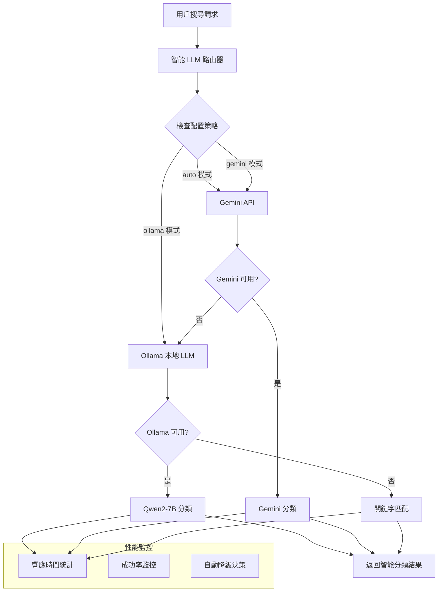

# 📄 SmartCompare AI - 設計邏輯與實作說明

## 一、動機與問題場景

在接到這次 Vibe Coding 筆試後，我希望設計一個題目，能同時呼應貴公司的領域背景，也展現我對使用者體驗與邏輯架構的思考。起初我想到自己在逛電商平台時的經驗，發現搜尋體驗時常讓人困擾——即使輸入了明確的關鍵字，搜尋結果中卻仍會出現不少不相關的商品。

例如我曾想找讓烏龜休息的「烏龜平台」，但搜尋結果中卻摻雜了許多「烏龜車」這類名稱相近但完全不同用途的產品。這讓我在瀏覽時無法直接概覽我需要的所有商品，還得不斷略過這些無關內容，使用體驗不佳。

基於這個動機，我希望建立一個具備「商品內容分類」與「搜尋結果預處理能力」的比價平台，改善這類搜尋偏差問題。

開發初期，我透過 ChatGPT 協助構思整體專案架構與資料庫設計，建立 GitHub Repo 並以 Cursor 開始撰寫主體程式碼。我也將初步架構與想法導入 ChatGPT 的記憶，請它協助我擬定模組化開發流程。前端畫面則是先由我撰寫 prompt [💡 Lovable Prompts](LOVABLE_PROMPTS.md)，透過 Lovable 平台快速生成，接著再回到 Cursor 中整合與調整。

### 🎯 核心目標

- ✅ 能根據產品內容自動分類
- ✅ 支援多電商網站整合
- ✅ 多電商網站綜合排序價格

## 二、系統架構設計

### 🏗️ 智能 LLM 系統

#### 架構設計

#### 降級策略
| 優先級 | 提供商 | 優勢 | 限制 |
|--------|--------|------|------|
| 🥇 **第一級** | Gemini API | 高品質、穩定性佳 | API 費用、頻率限制 |
| 🥈 **第二級** | Ollama 本地 | 零成本、隱私保護、無頻率限制 | 需要本地安裝、計算資源 |
| 🥉 **第三級** | 關鍵字匹配 | 100% 可用、快速響應 | 準確度較低 |

### 🔍 搜尋 + 分類 + 比價 一站式整合

#### 1. 資料取得
- 使用 Puppeteer 編寫簡易爬蟲，成功抓取：
  - Momo：30 筆商品
  - PChome：40 筆商品
- 因時間限制與蝦皮反爬策略，尚未組入 Shopee

#### 2. 智能分類邏輯（LLM 多層架構）
- 分類商品不依賴用戶輸入關鍵字，而是依賴商品名稱 + 說明
- 分三層處理邏輯：
  1. **Gemini（雲端 API）**
     - 優：判斷分類項目較精準，且商品都能正確分到對應類別
     - 缺：免費方案有處理頻率和Token限制
     處理失敗則轉為Ollama
  2. **Ollama（本地 LLM）**
     - 優：零 API 成本
     - 缺：
        1. 判斷分類項目與商品分類皆明顯有感不太合理
        2. 經常出現返回JSON格式錯誤，導致後端遺漏取得商品
     處理失敗則轉為關鍵字匹配
  3. **關鍵字匹配**
     - 最低保險模組，適用於 LLM 無法使用時

#### 3. 快取功能
- 引入快取（基於商品名稱+source hash key）
- 減少重複使用 LLM 資源

## 三、設計優勢與待改進項目

### ✅ 優勢
- **多電商整合**：以後可擴充更多網站
- **分類準確性高**：Gemini 表現良好
- **具有容錯與降級能力**：避免用戶無回應體驗
- **快速伍採結構**：Node + React 可快速開發與測試

### 🛠️ 待改進（未完成項目）

| 項目 | 描述 |
|------|------|
| 平台擴充 | 目前僅支援 Momo 與 PChome，尚未整合蝦皮、Yahoo 等平台，未來可進一步研究其反爬策略並加入擴充彈性設計。 |
| 分類資料擴充 | 現階段僅約 70 筆商品，分類效果與 LLM 表現仍受限於樣本稀少，未來需持續擴增資料量以提升模型表現與泛化能力。 |
| 搜尋推薦機制 | 尚未實作 TF-IDF、向量相似度等推薦策略，目前分類僅為靜態結果，後續可引入語意搜尋與相似商品推薦增進體驗。 |
| LLM 模型優化 | 本地 Ollama 模型分類準確度不穩，且回傳格式常出錯，未來可考慮訓練自有分類模型或建立 LLM 結構化輸出保證機制。 |
| 高併發處理與測試 | 尚未針對 LLM 請求與快取機制進行壓力測試，高併發下效能與穩定性仍待驗證，可加入 queue 管理或批次預處理策略。 |

## 四、結論

本次筆試專案從實際搜尋體驗出發，嘗試結合現代化 LLM 推理架構與傳統比價功能，完成一個具有「智能降級」、「快取優化」、「多電商整合」的搜尋比價系統模型，展現個人對技術架構與使用者體驗的平衡設計能力。 
